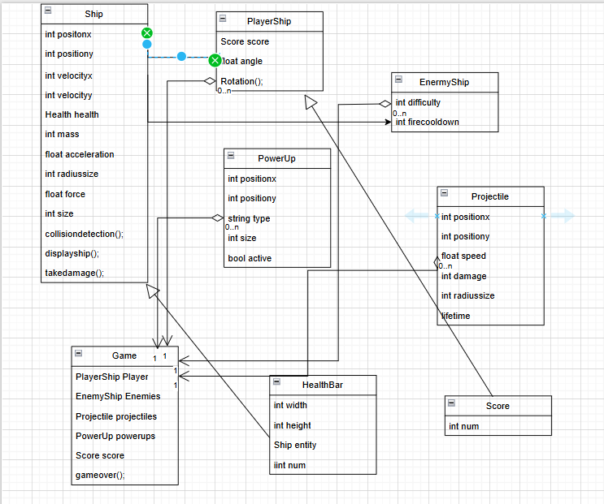
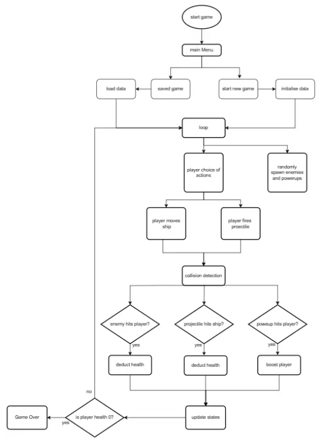

# Space Shooter Game

The Space Shooter game is a classic arcade-style game where the player controls a rocket ship, battling against enemy ships that spawn from different directions. The game runs on a main loop that continues until the player's health is depleted. The player must shoot down enemies, avoid collisions, and collect power-ups to gain temporary advantages.

## 1. Main Game Loop
The game operates on a continuous loop that:
- Updates the game state
- Checks for collisions
- Renders graphics until the player's health reaches zero

Each iteration of the loop:
1. Processes user input
2. Moves entities
3. Checks for collisions
4. Updates the display

## 2. Ship Class 
At the core of the design is a base `Ship` class that encapsulates common attributes and behaviors shared by all ships.

**Attributes:**
- Position (x, y)
- Velocity
- Mass
- Acceleration
- Health

**Methods:**
- `move()`
- `rotate()`
- `fire_projectile()`
- `take_damage()`

**Subclasses:**
- `PlayerShip`: Represents the player's controllable rocket ship
- `EnemyShip`: Represents the autonomous enemy ships of varying difficulty levels

## 3. Player Controls and Movement
- The `PlayerShip` starts at the center of the screen
- Rotate left/right using the left and right arrow keys
- Move forward/backward along current direction using up/down keys (fixed velocity)
- Screen wrapping: when moving out of bounds, ship reappears on opposite side
- Fire projectiles in current rotation direction by pressing spacebar

## 4. Enemy Behavior and Spawning
- `EnemyShip` instances spawn randomly from any direction at screen boundaries
- Automatically move towards player
- Fire projectiles at fixed time intervals
- Each has its own visible health bar
- Take damage from player projectiles or collisions
- Face and move towards player
- Can wrap around screen like PlayerShip

## 5. Physics Integration
Each ship maintains:
- Mass
- Force
- Acceleration
- Velocity

These properties are updated dynamically during gameplay to reflect changes from power-ups or collisions.

## 6. Projectiles and Collision Detection
Both player and enemies use instances of a `Projectile` class.

**Player Projectiles:**
- Fired only when player presses Spacebar
- Travel in direction ship is facing

**Enemy Projectiles:**
- Automatically fired at fixed intervals

**Collision Detection:**
- Calculates distance between centers of ships or between ship and projectile
- When collision detected, applies damage via `take_damage()` method

## 7. Power-ups System
- Spawn randomly on screen
- Only interact with PlayerShip (enemies pass through them)
- Temporary effects last 15 seconds after collection

**Power-up Types:**
- Sped-Up Projectiles: Increases projectile speed
- Bigger Projectiles: Increases projectile size for stronger hits
- Shield: Protects player from damage temporarily

## 8. Scoring and Health System
**Player:**
- Health bar decreases when hit by enemy projectiles or collisions
- Visible on screen

**Enemies:**
- Each has visible health bar
- Health decreases from player projectiles or collisions

**Scoring:**
- Tracks enemies defeated by player
- Displayed at top right of screen

## 9. UML 

## 10. Flowchart

